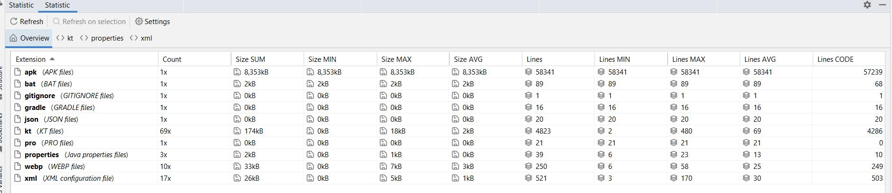
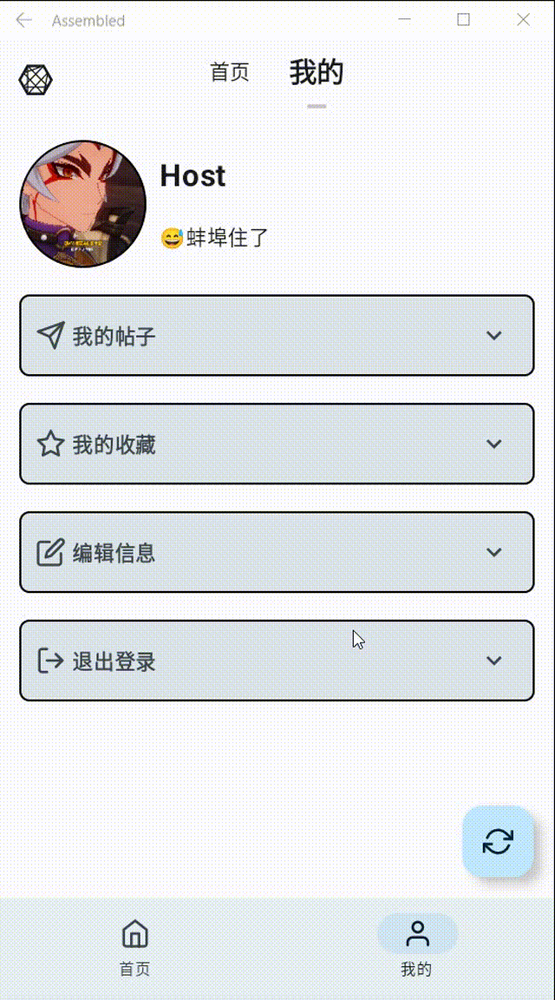
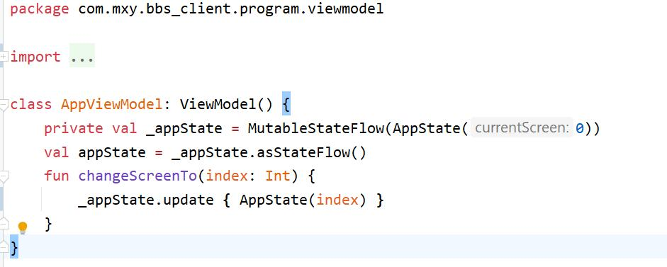
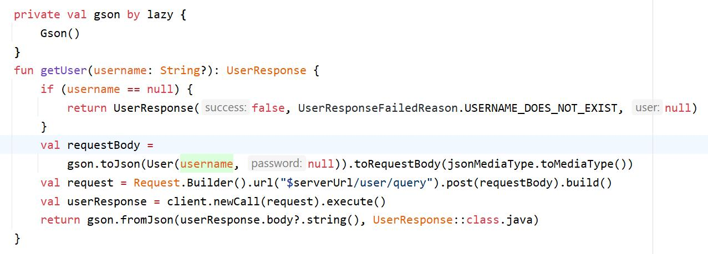
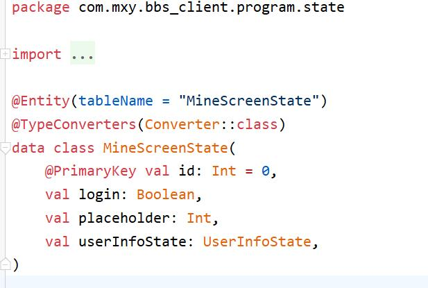

# Assembled

## `Android`应用程序

采用`Android Studio` + `Kotlin`开发, 具体技术见`实现`部分.

代码行数:

### 概览

其实本来准备写`Flutter`跨平台的, 也花费了2天熟悉`Dart`语法, 但是发现网上的资料非常少, 这种少不仅仅是在中文资料上, 英文资料也不是很多.(后来在查资料的过程中证明没选择`Fultter`是正确的)

于是准备干回老本行 —— `Android`应用程序开发.

本次`Android`应用程序采用`Jetpack Compose`作为`UI`框架, 使用`Room`访问本地的`sqlite`数据库,使用`okHttp3` + `Coroutine`完成后台的网络请求, `ViewModel`作为`App`的状态保存单元, 应用程序的整体设计风格采用`Google`2022年12月份推出的`Material3 Design`(主要是`Material2`的风格有点不适合现代审美).

整体`App`风格比较简洁, 分为两个页面, `主页`和`我的`:

在`首页`用户可以再无线刷新的列表中浏览帖子, 点击某一帖子会进入详情页, 在详情页可以浏览帖子更详细的信息以及收藏评论等:

点击`+`按钮发新帖, `Bottom Sheet`风格模仿了`iOS`系统:

在`我的`页面记录了当前登录用户的一些信息, 包括我的帖子、我的收藏, 如果用户想更改头像、昵称和个人签名, 也可以打开`编辑信息`菜单进行修改:

也可以进行刷新:

由于使用了`Material3 Design`, 本应用程序天然支持`Android 12`的`Dynamic Color`:

当然, 夜间模式也不在话下:

### 实现

#### `UI`

由于上学期就是用`Compose`完成的结课设计, 所以本次`UI`做起来不是很难, 相比于上学期, 这次多学习了一些东西, 一是`Compose Animation`, 二是如何使用好`ViewModel`管理状态.

`Compose`函数接收数据来渲染, 当点击`Compose`中可互动的内容时(比如点击`Button`), 调用对应`ViewModel`中的方法(这时`Compose`不仅要接受数据作为参数, 还需要引用`ViewModel`作为参数), 由`ViewModel`负责更改状态, 这个转态改变会通知`Compose`, 得以重新渲染出新的内容.

对于`ViewModel`的写法, 这里参考了`Google`官方给的样例:

#### `Client`

客户端采用`okHttp`开发, 对于`Response`, 这里采用了`Gson`进行反序列化:

由于客户端大部分都是样板代码,这里就不展示过多了. 

其中的小插曲便是, 有一些用户比较"顽皮", 他们喜欢反复点击收藏或点赞按钮, 这样会造成一个问题: 客户端会反复发送收藏和取消收藏的请求, 不仅浪费性能, 网络状况不好是还会出现渲染延迟.

这里的解决方案是, 如果用户能点击点赞或收藏, 说明, 用户一定在帖子详情界面, 这时尽管用户反复点击, 不会触发客户端的请求发送, 当且仅当用户点击"返回"离开帖子详情界面时, 才会触发收藏或点赞请求.这个方案参考了操作系统如何处理内存写的请求.

#### `Database`

应用程序需要记住用户的登录状态, 这就需要将登录状态保存到本地数据库.

这里采用了`Room`作为数据存取框架, 整体写起来也比较简单, 都是一些模板代码, 但同样出现了一些插曲.

这里`sqlite`显然不知道如何存储`UserInfoState`类型, 所以需要`Converter`, 但是第一次笔者只加了`UserInfoState` -> `String`的`Converter`(显然是通过`Gson`序列化), 但反复编译还是报错. 搜了很久也没搜到解决方案, 于是上官网看`Room`的样例, 抱着尝试的心情又在`Converter`中添加了`String` -> `UserInfoState`的方法, 编译运行, 成功!

也就是说, 如果通过`Room`插入`sqlite`数据库时, 如果实体有自定义类型, 就需要`Converter`, 但是这个`Converter`**必须**是双向的 —— 既能转成`String`, 又能转回来.

### 总结

尽管困难重重, 但是看到最终的`App`在物理机上跑起来的那一刻, 觉得努力没有白费.

开发过程也让我的英语水平提升了不少, 尤其时面对`Material3`时.

当然, 对`ViewModel`的理解更是加深了一大步.
